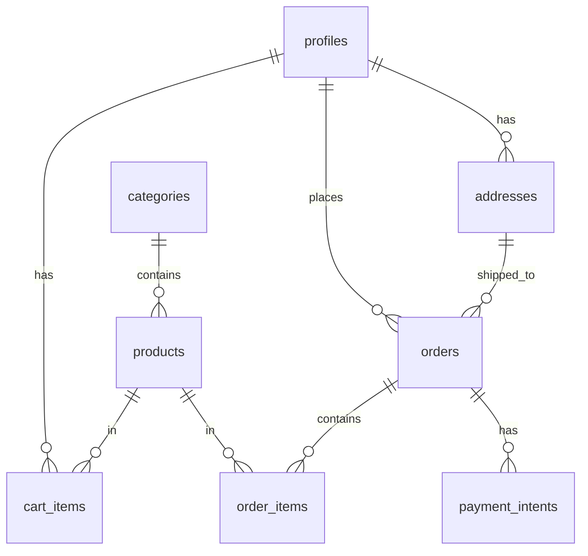

# 🗄️ FASE 2: BANCO DE DADOS

## 📋 Visão Geral

A Fase 2 implementa toda a estrutura do banco de dados no Supabase, incluindo tabelas, relacionamentos, políticas de segurança e triggers.

**Duração**: 2 horas  
**Prioridade**: Alta  
**Dependências**: Fase 1 concluída

---

## 🎯 Objetivos da Fase 2

1. ✅ Schema SQL completo criado
2. ✅ RLS implementado em todas as tabelas
3. ✅ Policies de segurança definidas
4. ✅ Documentação do banco criada
5. ✅ Credenciais do Supabase configuradas

---

## 📊 Estrutura do Banco

### Tabelas Principais

#### 1. **profiles** - Perfis de usuário
```sql
CREATE TABLE profiles (
    id UUID REFERENCES auth.users(id) PRIMARY KEY,
    email TEXT UNIQUE NOT NULL,
    full_name TEXT,
    phone TEXT,
    cpf TEXT,
    role TEXT DEFAULT 'customer' CHECK (role IN ('customer', 'admin')),
    created_at TIMESTAMP WITH TIME ZONE DEFAULT NOW(),
    updated_at TIMESTAMP WITH TIME ZONE DEFAULT NOW()
);
```

#### 2. **categories** - Categorias de produtos
```sql
CREATE TABLE categories (
    id SERIAL PRIMARY KEY,
    name TEXT NOT NULL,
    slug TEXT UNIQUE NOT NULL,
    description TEXT,
    image_url TEXT,
    is_active BOOLEAN DEFAULT true,
    created_at TIMESTAMP WITH TIME ZONE DEFAULT NOW()
);
```

#### 3. **products** - Produtos
```sql
CREATE TABLE products (
    id UUID DEFAULT gen_random_uuid() PRIMARY KEY,
    sku TEXT UNIQUE NOT NULL,
    name TEXT NOT NULL,
    slug TEXT UNIQUE NOT NULL,
    description TEXT,
    price DECIMAL(10,2) NOT NULL,
    sale_price DECIMAL(10,2),
    stock_quantity INTEGER DEFAULT 0,
    category_id INTEGER REFERENCES categories(id),
    images TEXT[] DEFAULT '{}',
    specifications JSONB DEFAULT '{}',
    is_featured BOOLEAN DEFAULT false,
    is_active BOOLEAN DEFAULT true,
    created_at TIMESTAMP WITH TIME ZONE DEFAULT NOW(),
    updated_at TIMESTAMP WITH TIME ZONE DEFAULT NOW()
);
```

#### 4. **cart_items** - Itens do carrinho
```sql
CREATE TABLE cart_items (
    id UUID DEFAULT gen_random_uuid() PRIMARY KEY,
    user_id UUID REFERENCES auth.users(id) ON DELETE CASCADE,
    product_id UUID REFERENCES products(id) ON DELETE CASCADE,
    quantity INTEGER DEFAULT 1,
    created_at TIMESTAMP WITH TIME ZONE DEFAULT NOW(),
    updated_at TIMESTAMP WITH TIME ZONE DEFAULT NOW(),
    UNIQUE(user_id, product_id)
);
```

#### 5. **addresses** - Endereços dos usuários
```sql
CREATE TABLE addresses (
    id UUID DEFAULT gen_random_uuid() PRIMARY KEY,
    user_id UUID REFERENCES auth.users(id) ON DELETE CASCADE,
    cep TEXT NOT NULL,
    street TEXT NOT NULL,
    number TEXT NOT NULL,
    complement TEXT,
    neighborhood TEXT NOT NULL,
    city TEXT NOT NULL,
    state TEXT NOT NULL,
    is_default BOOLEAN DEFAULT false,
    created_at TIMESTAMP WITH TIME ZONE DEFAULT NOW()
);
```

#### 6. **orders** - Pedidos
```sql
CREATE TABLE orders (
    id UUID DEFAULT gen_random_uuid() PRIMARY KEY,
    order_number TEXT UNIQUE NOT NULL,
    user_id UUID REFERENCES auth.users(id),
    address_id UUID REFERENCES addresses(id),
    status TEXT DEFAULT 'pending' CHECK (status IN ('pending', 'processing', 'shipped', 'delivered', 'cancelled')),
    payment_status TEXT DEFAULT 'pending' CHECK (payment_status IN ('pending', 'paid', 'failed', 'refunded')),
    subtotal DECIMAL(10,2) NOT NULL,
    shipping_cost DECIMAL(10,2) DEFAULT 0,
    discount DECIMAL(10,2) DEFAULT 0,
    total DECIMAL(10,2) NOT NULL,
    notes TEXT,
    tracking_code TEXT,
    created_at TIMESTAMP WITH TIME ZONE DEFAULT NOW(),
    updated_at TIMESTAMP WITH TIME ZONE DEFAULT NOW()
);
```

#### 7. **order_items** - Itens dos pedidos
```sql
CREATE TABLE order_items (
    id UUID DEFAULT gen_random_uuid() PRIMARY KEY,
    order_id UUID REFERENCES orders(id) ON DELETE CASCADE,
    product_id UUID REFERENCES products(id),
    product_name TEXT NOT NULL,
    product_sku TEXT NOT NULL,
    quantity INTEGER NOT NULL,
    unit_price DECIMAL(10,2) NOT NULL,
    total_price DECIMAL(10,2) NOT NULL,
    created_at TIMESTAMP WITH TIME ZONE DEFAULT NOW()
);
```

#### 8. **payment_intents** - Intenções de pagamento
```sql
CREATE TABLE payment_intents (
    id UUID DEFAULT gen_random_uuid() PRIMARY KEY,
    order_id UUID REFERENCES orders(id) ON DELETE CASCADE,
    provider TEXT,
    external_id TEXT,
    amount DECIMAL(10,2) NOT NULL,
    status TEXT DEFAULT 'pending' CHECK (status IN ('pending', 'paid', 'failed', 'refunded')),
    metadata JSONB DEFAULT '{}',
    created_at TIMESTAMP WITH TIME ZONE DEFAULT NOW(),
    updated_at TIMESTAMP WITH TIME ZONE DEFAULT NOW()
);
```

---

## 🔐 Row Level Security (RLS)

### Políticas Implementadas

#### Profiles
```sql
-- Usuários podem ver e editar apenas seu próprio perfil
CREATE POLICY "Users can view own profile" ON profiles FOR SELECT USING (auth.uid() = id);
CREATE POLICY "Users can update own profile" ON profiles FOR UPDATE USING (auth.uid() = id);

-- Admins podem ver todos os perfis
CREATE POLICY "Admins can view all profiles" ON profiles FOR SELECT USING (
    EXISTS (
        SELECT 1 FROM profiles
        WHERE id = auth.uid() AND role = 'admin'
    )
);
```

#### Products
```sql
-- Produtos ativos são visíveis para todos
CREATE POLICY "Active products are viewable by everyone" ON products FOR SELECT USING (is_active = true);

-- Admins podem fazer tudo
CREATE POLICY "Admins can manage products" ON products FOR ALL USING (
    EXISTS (
        SELECT 1 FROM profiles
        WHERE id = auth.uid() AND role = 'admin'
    )
);
```

#### Cart Items
```sql
-- Usuários podem gerenciar apenas seus próprios itens do carrinho
CREATE POLICY "Users can manage own cart items" ON cart_items FOR ALL USING (auth.uid() = user_id);
```

#### Orders
```sql
-- Usuários podem ver apenas seus próprios pedidos
CREATE POLICY "Users can view own orders" ON orders FOR SELECT USING (auth.uid() = user_id);

-- Admins podem ver todos os pedidos
CREATE POLICY "Admins can view all orders" ON orders FOR SELECT USING (
    EXISTS (
        SELECT 1 FROM profiles
        WHERE id = auth.uid() AND role = 'admin'
    )
);
```

---

## 🔧 Triggers e Funções

### 1. Criação automática de profile
```sql
CREATE OR REPLACE FUNCTION create_profile_for_user()
RETURNS TRIGGER AS $$
BEGIN
    INSERT INTO profiles (id, email, full_name, phone, cpf, role)
    VALUES (
        NEW.id,
        NEW.email,
        NEW.raw_user_meta_data->>'full_name',
        NEW.raw_user_meta_data->>'phone',
        NEW.raw_user_meta_data->>'cpf',
        'customer'
    );
    RETURN NEW;
END;
$$ LANGUAGE plpgsql SECURITY DEFINER;

CREATE TRIGGER create_profile_trigger
AFTER INSERT ON auth.users
FOR EACH ROW EXECUTE FUNCTION create_profile_for_user();
```

### 2. Geração automática de número do pedido
```sql
CREATE OR REPLACE FUNCTION generate_order_number()
RETURNS TRIGGER AS $$
BEGIN
    NEW.order_number := 'MS' || TO_CHAR(NOW(), 'YYYYMMDD') || '-' || LPAD(nextval('order_sequence')::text, 4, '0');
    RETURN NEW;
END;
$$ LANGUAGE plpgsql;

CREATE SEQUENCE order_sequence;
CREATE TRIGGER generate_order_number_trigger
BEFORE INSERT ON orders
FOR EACH ROW EXECUTE FUNCTION generate_order_number();
```

### 3. Atualização automática de timestamps
```sql
CREATE OR REPLACE FUNCTION update_updated_at_column()
RETURNS TRIGGER AS $$
BEGIN
    NEW.updated_at = NOW();
    RETURN NEW;
END;
$$ LANGUAGE plpgsql;

-- Aplicar a todas as tabelas que têm updated_at
CREATE TRIGGER update_products_updated_at BEFORE UPDATE ON products
FOR EACH ROW EXECUTE FUNCTION update_updated_at_column();

CREATE TRIGGER update_orders_updated_at BEFORE UPDATE ON orders
FOR EACH ROW EXECUTE FUNCTION update_updated_at_column();
```

---

## 📁 Storage Configuration

### Bucket para produtos
```sql
-- Criar bucket para imagens de produtos
INSERT INTO storage.buckets (id, name, public) VALUES ('products', 'products', true);

-- Política para upload de imagens (apenas admins)
CREATE POLICY "Admins can upload product images" ON storage.objects FOR INSERT WITH CHECK (
    bucket_id = 'products' AND
    EXISTS (
        SELECT 1 FROM profiles
        WHERE id = auth.uid() AND role = 'admin'
    )
);

-- Política para visualizar imagens (público)
CREATE POLICY "Anyone can view product images" ON storage.objects FOR SELECT USING (
    bucket_id = 'products'
);
```

---

## 🌱 Dados de Exemplo

### Categorias
```sql
INSERT INTO categories (name, slug, description, is_active) VALUES
('Peças de Motor', 'pecas-motor', 'Peças e componentes para motor', true),
('Sistema Elétrico', 'sistema-eletrico', 'Componentes elétricos e eletrônicos', true),
('Suspensão', 'suspensao', 'Peças de suspensão e amortecimento', true),
('Freios', 'freios', 'Sistema de freios e componentes', true),
('Filtros', 'filtros', 'Filtros de ar, óleo e combustível', true);
```

### Produtos de exemplo
```sql
INSERT INTO products (sku, name, slug, description, price, category_id, is_active, is_featured) VALUES
('VV001', 'Vela de Ignição NGK', 'vela-ignicao-ngk', 'Vela de ignição NGK para motores 1.0 a 2.0', 29.90, 1, true, true),
('FL001', 'Filtro de Ar Tecfil', 'filtro-ar-tecfil', 'Filtro de ar esportivo Tecfil', 45.50, 5, true, false),
('AM001', 'Amortecedor Dianteiro', 'amortecedor-dianteiro', 'Amortecedor dianteiro para Gol G5', 189.90, 3, true, true);
```

---

## 📊 Relacionamentos



---

## ✅ Validação da Fase 2

- [x] Schema SQL completo criado
- [x] RLS implementado em todas as tabelas
- [x] Policies de segurança definidas
- [x] Triggers funcionando corretamente
- [x] Storage bucket configurado
- [x] Dados de exemplo inseridos
- [x] Documentação do banco criada

---

## 🚀 Comandos de Execução

### No Supabase SQL Editor:
1. Execute `supabase/migrations/001_initial_schema.sql`
2. Execute `supabase/migrations/002_storage_setup.sql`
3. Verifique se todas as tabelas foram criadas
4. Teste as políticas de segurança

### Verificação:
```sql
-- Listar todas as tabelas
SELECT tablename FROM pg_tables WHERE schemaname = 'public';

-- Verificar RLS
SELECT tablename, rowsecurity FROM pg_tables WHERE schemaname = 'public';

-- Testar políticas
SET ROLE anon;
SELECT * FROM products WHERE is_active = true;
```

---

## 🎯 Próximos Passos

Após concluir a Fase 2, seguimos para a **Fase 3: Sistema Base**:
- Tipos TypeScript para todas as entidades
- Clientes Supabase configurados
- Middleware de autenticação
- Layout principal (Header + Footer)

---

**Status**: ✅ Concluída  
**Data**: 17/01/2025